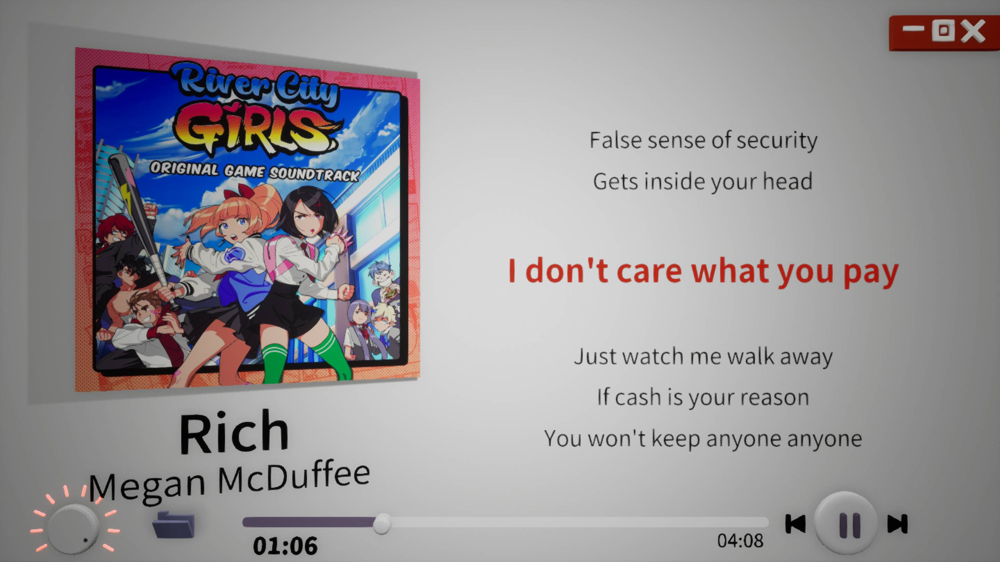
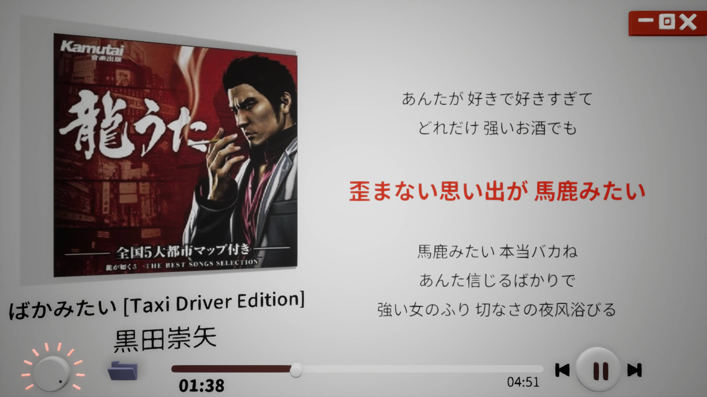
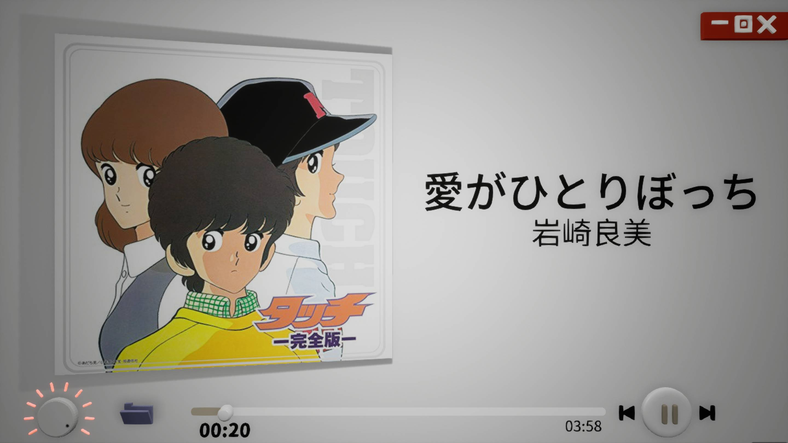

# Music3D

 

**虚幻4做的3D音乐播放器！**

**A 3D Music Player made with Unreal Engine 4！**

## 特点 Feature

别管有没有用，好看、酷炫就完事了！动效拉满了，音量是个旋钮，封面切换时是从一边飞过来的！

Never mind whether it's useful or not, as long as it looks good and COOLLL, that's all! The animation is very rich, the volume is a knob, and the cover transitions by flying from one side!

播放器在后台时是停止渲染的，没有GPU消耗。

When the player is in the background, it stops rendering and has no GPU consumption.

## 在哪下载 Where to download

右边Release，下载`Music3D-Win64.rar`，目前仅支持Windows.

Go to the release page on the right and download `Music3D-Win64.rar`, which currently only supports Windows.

## 使用方法 How to use

打开程序，左下角点击文件夹，选择一个文件夹进行随机播放。左边音量旋钮，鼠标悬停在上面，滚轮调音量，也可以左键按住直接拖。右下角和右上角是常用的几个按键就不说了。

Open the program, click on the folder in the bottom left corner, and select a folder for random playback. Left volume knob, hover the mouse over it, scroll to adjust the volume, or hold down the left button and drag directly. The lower right corner and upper right corner are commonly used buttons, so let's not talk about them.

方向上下调音量，左右切歌，空格暂停。

Use the up and down arrow keys to adjust the volume, the left and right arrow keys to switch songs, and the space bar to pause.

## 后续要加(鸽)的功能 Future update

1. 顺序播放

2. 支持系统级媒体按键：上一首、暂停、下一首。

3. 不锁定分辨率

4. 支持其他操作系统

5. 允许画质设置

 

1. Sequential playback

2. Support system level media buttons: Previous, Pause, Next.

3. Do not lock the window resolution

4. Support other operating systems

5. Support render quality settings

## 构建依赖 If you want to build it

1. UE 4.27.2 + VS 2017 + Windows x64
2. 免费插件(free plugin): [Easy File Dialog](https://fab.com/s/cd9f3136efee)

## License

This project is released under the MIT license.
